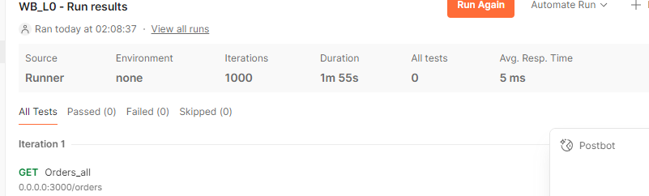

## TL-DR

Для запуска через докер:

```bash
docker compose up --build
```

Это построит и запустит контейнер с redis, postgres (с нужными таблицами) и контейнер с сервером AXUM, 
слушающем на порту 3000

Далее для добавление тестовых данных можно запустить скрипт:

```bash
cargo run --bin add_orders_to_db_script --features add_orders_dependencies
```

## Запросы

- Для получения всех заказов из базы данных:
```
GET-запрос к 0.0.0.0:3000/orders
```

---

- Для получения одного заказа по uuid:
```
GET-запрос к 0.0.0.0:3000/orders/:[uuid]
```
пример:

```
GET 0.0.0.0:3000/orders/3f46be32-cc4d-408a-a31f-95a6ce17c037
```
---

- Для добавления нового заказа:
```
POST-запрос к 0.0.0.0:3000/orders с нужным json в теле запроса
```

## Дополнительные скрипты

Удалить таблицы c данными из postgres
```bash
cargo run --bin drop_pg_tables_script 
```

Создать нужные таблицы в postgres
```bash
cargo run --bin create_pg_tables_script
```

## Тесты

Для тестов при текущей имплементации лучше перезапустить docker-compose и не добавлять данные в базу, затем запустить:

```bash
cargo test --lib -- --test-threads=1 
```

## Бенчмарк

Простенький бенчмарк получения всех заказов из базы. На 1000 запросов в 2 минуты - 5 милисикунд в среднем на запрос.

